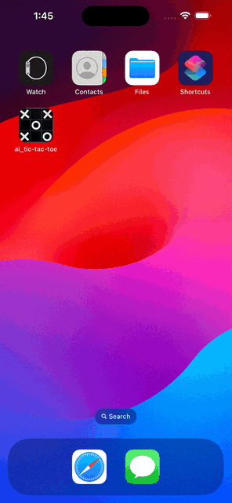

AI Tic-Tac-Toe
===============

A SwiftUI single-player SwiftUI game.

It is a game between the User and the phone, which hosts the AI.

This app uses:
* Swift
* SwiftUI
* async-await concurrency
* Swift-Data

