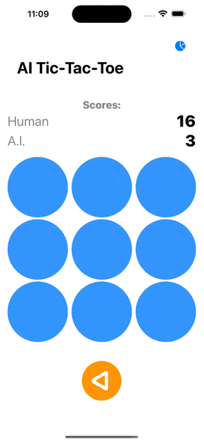

AI Tic-Tac-Toe
===============

A SwiftUI single-player SwiftUI game.

It is a game between the User and the phone, which hosts the AI.

This app uses:
* Swift
* SwiftUI
* * Lazy Grid View
* * Screen Overlays
* * SF Symbols
* * Custom Alerts using AlertItems
* Swift-Data
* Swift charts
* async-await / concurrency

### Sea also:
* [Health Kit Demo](https://github.com/arthurkahwa/healthkit_showcase)
* [Apple Watch Store](https://github.com/arthurkahwa/apple_watch_store)